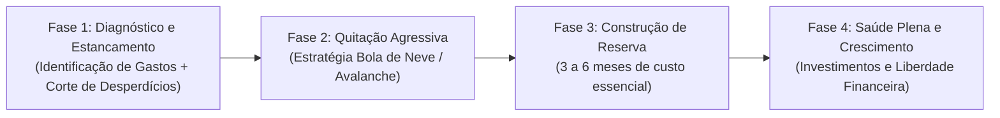

# Visão Geral e Objetivos do Sistema de Controle Financeiro

**Membros:** Anselmo e Nathália  
**Data de Início:** Agosto/2026  
**Status:** Fase de Definição e Modelagem Conceitual

---

## 1. Propósito e Filosofia do Sistema

O objetivo deste sistema não é apenas registrar "onde o dinheiro foi gasto", mas fornecer **clareza, previsibilidade e estratégia** para transformar a dinâmica financeira familiar.

### Pilares Fundamentais:
1. **Transparência e Parceria:** Clareza total sobre a contribuição e custo de cada membro, respeitando a individualidade e fortalecendo o patrimônio comum.
2. **Priorização por Impacto:** Foco imediato na eliminação de dívidas e construção de reserva antes de expansões de padrão de vida.
3. **Detecção Antecipada:** Identificar desvios orçamentários e hábitos de consumo desalinhados em tempo hábil (evitando sustos no fim do mês).
4. **Projeção e Decisão:** Simular cenários futuros para compras, viagens e decisões de médio/longo prazo com embasamento numérico.

---

## 2. Metas e Fases da Jornada Financeira

### Detalhamento das Metas:

| Meta | Objetivo Específico | Métrica de Sucesso |
| :--- | :--- | :--- |
| **1. Identificação Total** | 100% dos lançamentos categorizados e vinculados a um responsável e centro de custo. | 0 lançamentos sem classificação no fechamento mensal. |
| **2. Eliminação de Dívidas** | Plano estruturado de amortização de todas as dívidas caras/juros. | Saldo devedor total decrescente mês a mês até zerar. |
| **3. Fundo de Reserva** | Criação de reserva de emergência equivalente a 3–6 meses do custo de vida essencial da casa. | Meta de reserva atingida e blindada em liquidez diária. |
| **4. Detecção de Desconexão** | Alertas automáticos quando uma categoria ultrapassar o teto orçamentário parametrizado. | Gastos com estilo de vida contidos dentro dos limites pactuados. |
| **5. Equilíbrio Individual/Casal** | Visão do balanço entre receitas individuais e partilha dos custos comuns (casa/família). | Proporcionalidade justa acordada e acompanhada sem atritos. |
