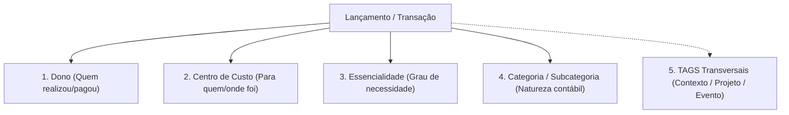

# Modelo de Dados, Taxonomia e Categorização — KIVO

**Status:** Aprovado  
**Padrão de Classificação:** 4 Dimensões Estruturais + Camada Transversal de Tags  

---

## 1. Visão Geral da Taxonomia

No KIVO, cada lançamento financeiro é categorizado de forma precisa para responder a todas as perguntas do indivíduo e da família:

---

## 2. As Dimensões de Classificação

### 1ª Dimensão: Dono (*Owner*)
* Identifica o membro do Workspace que realizou o pagamento ou contratou a obrigação (ex: *Anselmo*, *Nathália*).

### 2ª Dimensão: Centro de Custo (*Cost Center*)
* Define o destino do gasto para equalização de despesas:
  * **Casa / Moradia:** Aluguel, condomínio, energia, internet.
  * **Família / Filhos:** Escola, saúde familiar, compras conjuntas.
  * **Casal:** Jantares a dois, viagens a dois, cinema.
  * **Pessoal Individual (A ou B):** Gastos de uso exclusivo de cada pessoa (roupas, hobbies particulares, eletrônicos pessoais).

### 3ª Dimensão: Grau de Essencialidade (*Essentiality*)
* **Essencial:** Gastos de sobrevivência e manutenção básica (alimentação básica, moradia, saúde, transporte essencial). Base de cálculo da Reserva de Emergência.
* **Estilo de Vida:** Conforto, lazer, restaurantes, assinaturas, passeios.
* **Desperdício:** Gastos desconexos, juros por atraso, multas, assinaturas não utilizadas, compras impulsivas.
* **Dívida / Passivo:** Amortização de empréstimos, financiamentos e cartões.
* **Reserva / Investimento:** Aportes no cofre da reserva ou carteira patrimonial.

### 4ª Dimensão: Categoria e Subcategoria (*Category Tree*)
* A natureza técnica do gasto (Alimentação $\rightarrow$ Supermercado, Transporte $\rightarrow$ Combustível).

---

## 🏷️ 5ª Dimensão Transversal: Tags (Etiquetas e Projetos)

As **Tags** são etiquetas livres, coloridas e transversais criadas pelo próprio usuário para agrupar gastos que pertencem ao mesmo **contexto, projeto ou evento**, independentemente da categoria.

### Casos de Uso das Tags:
* **Viagens e Férias:** `#ViagemGramado2026`, `#FeriasNordeste` (agrupa hotel, passagens, restaurantes, passeios).
* **Projetos e Reformas:** `#ReformaCozinha`, `#PinturaApartamento`.
* **Momentos Sazonais:** `#Natal2026`, `#BlackFriday`, `#VoltaAsAulas`.
* **Despesas Corporativas Reembolsáveis:** `#ReembolsoEmpresa`.
* **Auditorias de Hábitos:** `#DeliveryMadrugada`, `#ComprasPorImpulso`.
