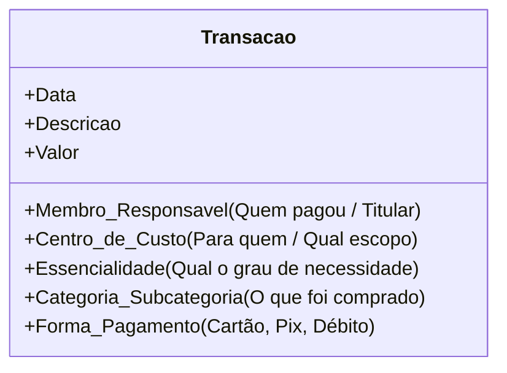
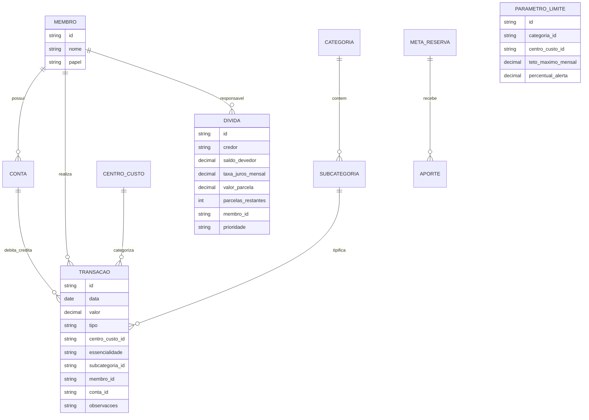

# Modelo Conceitual e Categorização Multidimensional

Para atender a todos os objetivos do Anselmo e da Nathália, o sistema não pode utilizar uma categorização simples de lista única. É necessária uma **visão multidimensional** de cada transação financeira.

---

## 1. As Quatro Dimensões de Toda Despesa

Cada centavo gasto será classificado sob 4 eixos analíticos:

---

### Dimensão 1: Titularidade / Responsável
Quem realizou o desembolso ou a qual cartão/conta a despesa está vinculada:
- **Anselmo**
- **Nathália**
- **Ambos / Conta Conjunta** (quando houver)

---

### Dimensão 2: Centro de Custo (Escopo / Pertencimento)
Define **para quem** ou **para o que** o gasto serviu:

| Centro de Custo | Descrição | Exemplos |
| :--- | :--- | :--- |
| **🏠 Casa / Habitação** | Manutenção direta do lar e infraestrutura básica. | Aluguel/Condomínio, Energia, Água, Internet, Manutenção Predial, IPTU. |
| **👨‍👩‍👧 Família** | Despesas coletivas do núcleo familiar e dependentes. | Supermercado coletivo, Farmácia da casa, Pet, Educação dos filhos. |
| **💑 Casal / Relacionamento** | Gastos exclusivos para o bem-estar e lazer do casal a dois. | Encontros, jantares românticos, viagens do casal, presentes mútuos. |
| **👤 Anselmo (Individual)** | Gastos pessoais, hobbies, cuidados pessoais e escolhas individuais de Anselmo. | Roupas de Anselmo, cursos pessoais, almoços individuais de trabalho, hobbies. |
| **👤 Nathália (Individual)** | Gastos pessoais, cuidados pessoais e escolhas individuais de Nathália. | Roupas de Nathália, salão/estética, cursos pessoais, almoços individuais. |

---

### Dimensão 3: Grau de Essencialidade (Necessidade vs. Desperdício)
Fundamental para o diagnóstico de saúde financeira e corte rápido de custos:

1. **🟢 Essencial / Sobrevivência (Necessidades Básicas):**
   - Gastos indispensáveis que não podem ser cortados sem prejuízo à vida, moradia, trabalho ou saúde.
   - *Exemplos:* Contas de consumo básicas, alimentação essencial de supermercado, remédios contínuos, transporte para o trabalho.
2. **🟡 Estilo de Vida / Bem-Estar (Desejos & Conforto):**
   - Gastos que melhoram a qualidade de vida, mas que são negociáveis ou ajustáveis em tempos de crise.
   - *Exemplos:* Restaurantes, streaming, viagens, academia, vestuário não essencial, passeios.
3. **🔴 Desperdício / Evitável (Custo a Eliminar Imediatamente):**
   - Gastos que não agregam valor real, decorrentes de desatenção, compras por impulso ou má gestão.
   - *Exemplos:* Juros de cheque especial/rotativo de cartão, multas por atraso, assinaturas nunca usadas, comida estragada descartada, compras por impulso não utilizadas.
4. **🔵 Desalavancagem / Dívidas (Amortizações):**
   - Parcelas de empréstimos, financiamentos, renegociações de faturas.
5. **🟣 Futuro & Segurança (Reservas / Investimentos):**
   - Aportes na reserva de emergência, previdência ou investimentos de longo prazo.

---

### Dimensão 4: Categorias e Subcategorias Operacionais

Exemplo de árvore padronizada de categorias:

- **Alimentação**
  - Supermercado & Feira (Família - Essencial)
  - Padaria & Conveniência (Família/Individual - Estilo de Vida)
  - Restaurantes & Bares (Casal/Individual - Estilo de Vida)
  - Delivery / iFood (Família/Casal/Individual - Estilo de Vida)
- **Moradia**
  - Aluguel / Financiamento
  - Condomínio & IPTU
  - Contas de Consumo (Energia, Gás, Água)
  - Internet / TV / Telefonia
  - Manutenção & Limpeza
- **Transporte**
  - Combustível
  - Seguro & IPVA
  - Manutenção Veicular
  - Aplicativos de Transporte (Uber/99)
  - Transporte Público
- **Saúde & Cuidados Pessoais**
  - Plano de Saúde & Consultas
  - Medicamentos Essenciais
  - Farmácia / Higiene
  - Cuidados Pessoais / Estética (Individual)
  - Academia / Esportes
- **Lazer & Cultura**
  - Cinema, Shows e Eventos
  - Viagens e Hospedagens
  - Assinaturas de Entretenimento (Netflix, Spotify, etc.)
- **Dívidas & Serviços Financeiros**
  - Empréstimos & Financiamentos
  - Tarifas Bancárias & Anuidades (candidatas a corte)
  - Juros de Cartão / Rotativo (Desperdício)
- **Rendimentos / Receitas**
  - Salário / Pró-labore Anselmo
  - Salário / Pró-labore Nathália
  - Rendas Extras / Freelance
  - Rendimentos de Aplicações

---

## 2. Entidades Principais do Modelo de Dados

