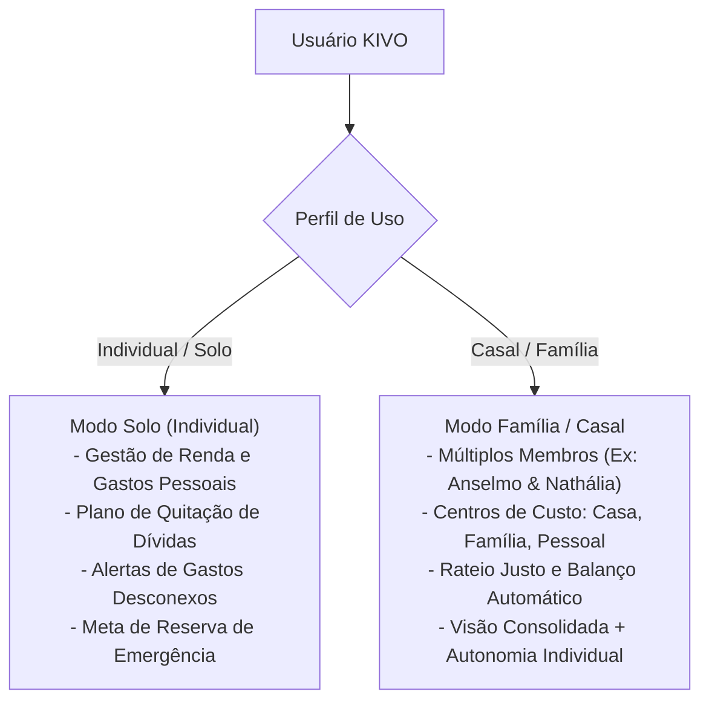

# Visão de Produto & Posicionamento do KIVO (SaaS)

Planejamento do **KIVO** como uma plataforma completa de inteligência e recuperação financeira, flexível para uso **Individual (Solo)** ou **Familiar/Casal (Multi-membro)**.

---

## 1. Posicionamento de Mercado & Proposta de Valor Universal

### A Dor Central do Mercado:
- Milhões de pessoas (indivíduos e famílias) vivem presas em ciclos de endividamento, sem clareza de onde o dinheiro está vazando (desperdícios e gastos desconexos com a sua realidade).
- A maioria dos apps de finanças são meros "cadernos digitais": registram o passado, mas não guiam o usuário passo a passo para **estancar vazamentos, quitar dívidas com inteligência matemática e construir uma reserva de emergência blindada**.

### A Proposta de Valor Única do KIVO:
> *"KIVO é a plataforma de inteligência financeira que transforma sua relação com o dinheiro: diagnostica vazamentos, traça o plano exato para zerar suas dívidas e constrói sua segurança financeira — seja você sozinho ou com sua família."*

---

## 2. Modos de Operação do KIVO (Arquitetura Flexível)

O KIVO adapta sua interface e seus módulos com base no perfil do usuário:

---

## 3. A Nova Narrativa Universal da Marca KIVO

O nome **KIVO** ganha uma força ainda maior quando aplicado à jornada individual e familiar:

### Pilares de Significado:
1. **Key (A Chave da Mudança):** A ferramenta prática que abre a porta para a liberdade financeira e tranca de vez os juros e dívidas no passado.
2. **Vivo (Vida Financeira Ativa):** Um sistema dinâmico, preditivo e em tempo real, que aprende os hábitos do usuário e avisa antes do descompasso acontecer.
3. **Pivô (O Ponto de Virada / Ponto de Equilíbrio):**
   - *No uso individual:* O momento da virada — quando o usuário passa do vermelho (endividado) para o verde (poupador/investidor).
   - *No uso em família/casal:* O ponto central de equilíbrio entre os membros e as contas da casa.

---

## 4. Slogans & Taglines Oficiais do KIVO

- **Slogan Principal (Universal):**  
  > **"KIVO — A chave da sua virada financeira."**
- **Taglines de Apoio:**  
  - *"Saia do vermelho, elimine desperdícios e construa seu futuro."*  
  - *"Controle total, dívida zero e previsibilidade para você e sua família."*  
  - *"Inteligência financeira na prática: para a sua vida e para a sua casa."*
