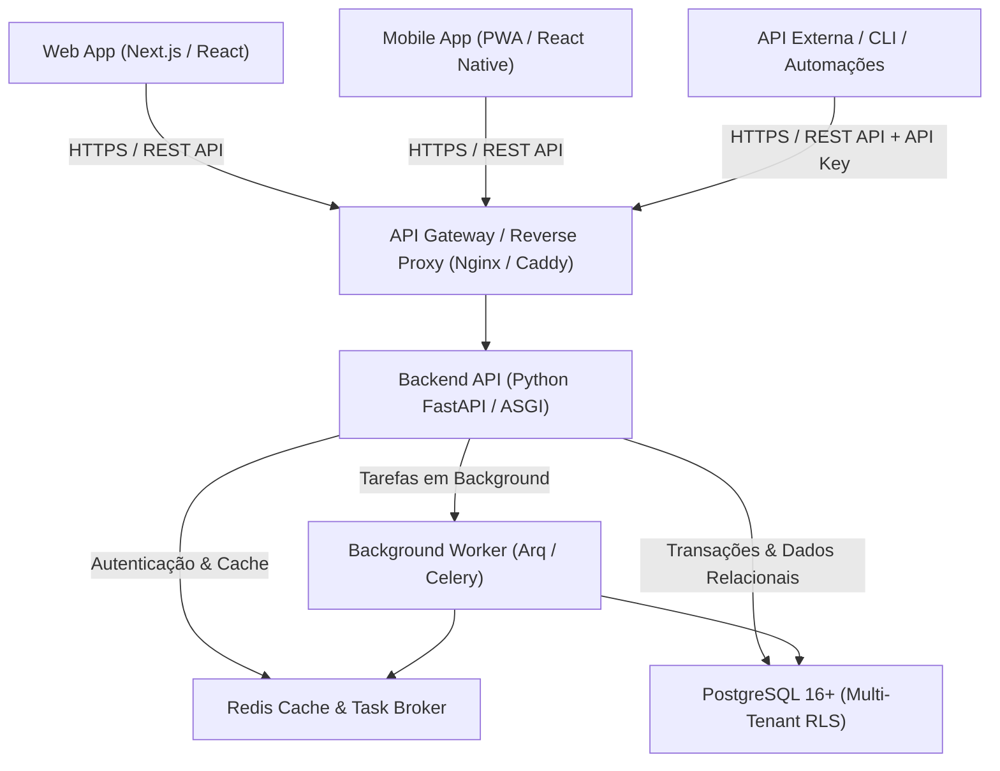

# Arquitetura de Software e Stack Tecnológica — KIVO

**Status:** Aprovado  
**Padrão Arquitetural:** Client-Server Desacoplado / API-First Full RESTful  
**Escalabilidade:** Multi-Tenant (Modo Solo e Modo Família)  

---

## 1. Visão Geral da Arquitetura

O KIVO adota o princípio **API-First**: 100% das operações de negócio, consultas, regras financeiras, parametrizações e autenticações são executadas através de uma **API RESTful completa e documentada**. O Frontend atua como um consumidor da API, garantindo que qualquer cliente (Web, Mobile iOS/Android, Scripts CLI, Integrações) tenha paridade total de recursos.

---

## 2. Definição da Stack Tecnológica

### 2.1. Backend (API RESTful de Alta Performance)
* **Linguagem & Runtime:** **Python 3.12+**
* **Framework Web:** **FastAPI**
  * *Por que FastAPI?* Alta performance nativa assíncrona (`asyncio` / `uvicorn`), geração automática de documentação interativa **OpenAPI 3.1 / Swagger**, e integração profunda com validação tipada.
* **Validação & Serialização:** **Pydantic V2** (escrito em Rust, validação ultra-rápida de DTOs e esquemas).
* **ORM & Acesso a Dados:** **SQLAlchemy 2.0 (Async)** com **Alembic** para controle rigoroso de migrações de esquema.
* **Precisão Numérica:** Tipagem estrita com **`Decimal` / `Numeric(15, 2)`** para cálculo financeiro exato (eliminação absoluta de erros de arredondamento de float binário).

---

### 2.2. Frontend (Interface Web & PWA)
* **Framework:** **Next.js 15+ (App Router) com React 19**
* **Linguagem:** **TypeScript 5.5+** (tipagem estrita compartilhada via esquemas OpenAPI).
* **Estilização & Design System:** **Tailwind CSS v4** + **Shadcn UI** (Radix UI primitives).
* **Gerenciamento de Estado de Servidor:** **TanStack Query (React Query v5)** (cache inteligente, revalidação em tempo real, mutações otimistas).
* **Formulários & Validação Client-Side:** **React Hook Form** + **Zod** (validação idêntica aos DTOs do backend).
* **Visualização Gráfica:** **Recharts** ou **Tremor** (gráficos de fluxo de caixa, termômetro da reserva e radar de desvios).
* **Ícones:** **Lucide Icons** + Assets PNG oficiais do KIVO.

---

### 2.3. Banco de Dados & Armazenamento Relacional
* **Banco Principal:** **PostgreSQL 16+**
* **Diferenciais Técnicos:**
  * Suporte a **UUIDv7** (chaves primárias ordenadas no tempo, otimizando índices B-Tree).
  * **Row Level Security (RLS)** para isolamento rigoroso entre diferentes Workspaces/Famílias.
  * Suporte a campos **JSONB** para parametrizações dinâmicas de alertas e preferências de rateio.
  * Transações ACID completas para conciliações e operações de estorno.

---

### 2.4. Camada de Cache, Sessões e Filas
* **Tecnologia:** **Redis 7+**
* **Casos de Uso no KIVO:**
  1. **Gerenciamento de Sessão & 2FA:** Armazenamento de tokens temporários de desafio 2FA (TTL de 5 minutos) e blocklist de tokens revogados.
  2. **Rate Limiting:** Proteção contra ataques de força bruta em rotas de login/2FA e abuso de endpoints.
  3. **Cache de Agregações Financeiras:** Cache de relatórios pesados de fluxo de caixa anual (invalidação orientada a eventos de novas transações).
  4. **Fila de Tarefas Assíncronas (Task Queue):** Processamento em background de importação de faturas (OFX/CSV) e disparo de notificações de alertas de teto estourado.
