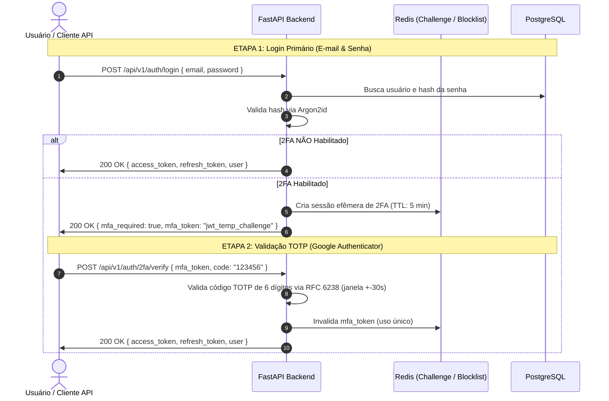

# Autenticação, Autorização e Segurança 2FA — KIVO

**Status:** Aprovado  
**Padrões:** RFC 6238 (TOTP), RFC 7519 (JWT), NIST Special Publication 800-63B  
**Segurança:** 2FA Nativo Obrigatório/Opcional, Senhas com Argon2id, Tokens com Rotação  

---

## 1. Visão Geral da Arquitetura de Segurança

O sistema KIVO lida com informações financeiras confidenciais. A camada de segurança é construída com **Zero-Trust**: toda requisição à API é autenticada, autorizada e isolada por Workspace.



---

## 2. Especificação do Mecanismo 2FA (Google Authenticator / TOTP)

### 2.1. Ativação do 2FA
1. O usuário autenticado solicita ativação: `POST /api/v1/auth/2fa/setup`.
2. O Backend gera um segredo criptográfico aleatório de 160 bits (codificado em Base32).
3. O Backend gera a URI padrão TOTP:
   ```
   otpauth://totp/KIVO:usuario@email.com?secret=JBSWY3DPEHPK3PXP&issuer=KIVO&algorithm=SHA1&digits=6&period=30
   ```
4. A API retorna o segredo em texto, o QR Code em base64 e **8 Códigos de Backup (Recuperação)** de 10 caracteres cada.
5. Os códigos de backup são salvos no banco **hasheados** (como senhas).
6. O usuário digita o primeiro código de 6 dígitos gerado pelo app no celular: `POST /api/v1/auth/2fa/enable`.
7. Uma vez validado o primeiro código, o 2FA é marcado como ativo no banco.

---

## 3. Estratégia de Tokens JWT e Sessão

| Tipo de Token | Formato | Duração | Armazenamento Recomendado | Finalidade |
| :--- | :--- | :--- | :--- | :--- |
| **Access Token** | JWT (RS256 ou HS256) | 15 minutos | Memória (RAM do Frontend / Authorization Header) | Autorizar requisições normais à API. |
| **Refresh Token** | String Criptográfica / UUID | 7 a 30 dias | Cookie `HttpOnly`, `Secure`, `SameSite=Strict` | Renovar o Access Token de forma transparente. |
| **MFA Challenge Token** | JWT com escopo `mfa_pending` | 5 minutos | Memória temporária | Autorizar exclusivamente a rota de validação 2FA. |

---

## 4. Hash de Senhas e Políticas de Proteção

- **Algoritmo de Hashing:** **Argon2id** (vencedor do Password Hashing Competition) ou **Bcrypt** (custo 12).
- **Proteção contra Força Bruta (Rate Limiting via Redis):**
  - Máximo de 5 tentativas de login incorretas por IP/E-mail a cada 15 minutos.
  - Bloqueio temporário progressivo em caso de excesso de tentativas.
- **Revogação de Sessão (Logout em Todos os Dispositivos):**
  - Invalidação imediata de todos os Refresh Tokens do usuário no banco/Redis.
