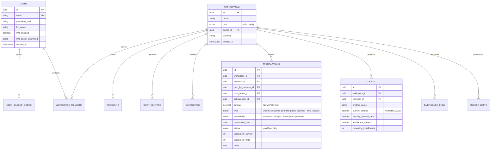

# Modelo de Banco de Dados Relacional (PostgreSQL) — KIVO

**Status:** Aprovado  
**Engine:** PostgreSQL 16+  
**Tipagem Numérica:** `NUMERIC(15, 2)` (Precisão financeira estrita)  
**Chaves Primárias:** `UUIDv7`  

---

## 1. Diagrama Entidade-Relacionamento (ERD)



---

## 2. Esquema DDL SQL Detalhado

```sql
-- 1. Tabela de Usuários do Sistema
CREATE TABLE users (
    id UUID PRIMARY KEY DEFAULT gen_random_uuid(),
    email VARCHAR(255) UNIQUE NOT NULL,
    password_hash VARCHAR(255) NOT NULL,
    full_name VARCHAR(150) NOT NULL,
    is_active BOOLEAN DEFAULT TRUE,
    mfa_enabled BOOLEAN DEFAULT FALSE,
    mfa_secret_encrypted TEXT NULL,
    created_at TIMESTAMPTZ DEFAULT NOW(),
    updated_at TIMESTAMPTZ DEFAULT NOW()
);

-- 2. Códigos de Recuperação 2FA (Backup Codes)
CREATE TABLE user_backup_codes (
    id UUID PRIMARY KEY DEFAULT gen_random_uuid(),
    user_id UUID NOT NULL REFERENCES users(id) ON DELETE CASCADE,
    code_hash VARCHAR(255) NOT NULL,
    used_at TIMESTAMPTZ NULL,
    created_at TIMESTAMPTZ DEFAULT NOW()
);

-- 3. Workspaces (Isolamento Multi-Tenant: Solo vs. Família)
CREATE TYPE workspace_type AS ENUM ('solo', 'family');

CREATE TABLE workspaces (
    id UUID PRIMARY KEY DEFAULT gen_random_uuid(),
    name VARCHAR(100) NOT NULL,
    type workspace_type NOT NULL DEFAULT 'solo',
    owner_id UUID NOT NULL REFERENCES users(id),
    currency VARCHAR(3) DEFAULT 'BRL',
    created_at TIMESTAMPTZ DEFAULT NOW(),
    updated_at TIMESTAMPTZ DEFAULT NOW()
);

-- 4. Membros do Workspace e Definições de Rateio
CREATE TYPE member_role AS ENUM ('owner', 'admin', 'member', 'viewer');

CREATE TABLE workspace_members (
    id UUID PRIMARY KEY DEFAULT gen_random_uuid(),
    workspace_id UUID NOT NULL REFERENCES workspaces(id) ON DELETE CASCADE,
    user_id UUID NOT NULL REFERENCES users(id) ON DELETE CASCADE,
    role member_role NOT NULL DEFAULT 'member',
    display_name VARCHAR(100) NOT NULL,
    declared_income NUMERIC(15, 2) DEFAULT 0.00,
    custom_split_percentage NUMERIC(5, 2) NULL, -- se nulo, calcula automático
    joined_at TIMESTAMPTZ DEFAULT NOW(),
    UNIQUE (workspace_id, user_id)
);

-- 5. Centros de Custo (Casa, Família, Casal, Pessoal A, Pessoal B)
CREATE TYPE cost_center_scope AS ENUM ('home', 'family', 'couple', 'individual');

CREATE TABLE cost_centers (
    id UUID PRIMARY KEY DEFAULT gen_random_uuid(),
    workspace_id UUID NOT NULL REFERENCES workspaces(id) ON DELETE CASCADE,
    name VARCHAR(100) NOT NULL,
    scope cost_center_scope NOT NULL,
    assigned_member_id UUID NULL REFERENCES workspace_members(id),
    created_at TIMESTAMPTZ DEFAULT NOW()
);

-- 6. Categorias e Subcategorias
CREATE TABLE categories (
    id UUID PRIMARY KEY DEFAULT gen_random_uuid(),
    workspace_id UUID NOT NULL REFERENCES workspaces(id) ON DELETE CASCADE,
    parent_id UUID NULL REFERENCES categories(id) ON DELETE CASCADE,
    name VARCHAR(100) NOT NULL,
    icon VARCHAR(50) DEFAULT 'folder',
    color VARCHAR(7) DEFAULT '#00D084',
    created_at TIMESTAMPTZ DEFAULT NOW()
);

-- 7. Contas Bancárias e Cartões de Crédito
CREATE TYPE account_type AS ENUM ('checking', 'credit_card', 'wallet', 'investment');

CREATE TABLE accounts (
    id UUID PRIMARY KEY DEFAULT gen_random_uuid(),
    workspace_id UUID NOT NULL REFERENCES workspaces(id) ON DELETE CASCADE,
    owner_member_id UUID NOT NULL REFERENCES workspace_members(id),
    name VARCHAR(100) NOT NULL,
    type account_type NOT NULL,
    initial_balance NUMERIC(15, 2) DEFAULT 0.00,
    credit_limit NUMERIC(15, 2) NULL,
    closing_day SMALLINT NULL,
    due_day SMALLINT NULL,
    is_active BOOLEAN DEFAULT TRUE,
    created_at TIMESTAMPTZ DEFAULT NOW()
);

-- 8. Transações Financeiras (Lançamentos)
CREATE TYPE transaction_type AS ENUM ('income', 'expense', 'transfer', 'debt_payment', 'fund_deposit');
CREATE TYPE essentiality_grade AS ENUM ('essential', 'lifestyle', 'waste', 'debt', 'reserve');
CREATE TYPE transaction_status AS ENUM ('paid', 'pending');

CREATE TABLE transactions (
    id UUID PRIMARY KEY DEFAULT gen_random_uuid(),
    workspace_id UUID NOT NULL REFERENCES workspaces(id) ON DELETE CASCADE,
    account_id UUID NOT NULL REFERENCES accounts(id),
    paid_by_member_id UUID NOT NULL REFERENCES workspace_members(id),
    cost_center_id UUID NOT NULL REFERENCES cost_centers(id),
    category_id UUID NOT NULL REFERENCES categories(id),
    amount NUMERIC(15, 2) NOT NULL,
    type transaction_type NOT NULL,
    essentiality essentiality_grade NOT NULL,
    transaction_date DATE NOT NULL,
    status transaction_status NOT NULL DEFAULT 'paid',
    series_id UUID NULL,
    installment_current INT DEFAULT 1,
    installment_total INT DEFAULT 1,
    description VARCHAR(255) NOT NULL,
    notes TEXT NULL,
    created_at TIMESTAMPTZ DEFAULT NOW(),
    updated_at TIMESTAMPTZ DEFAULT NOW()
);

-- 9. Dívidas e Passivos (Módulo Sair do Vermelho)
CREATE TABLE debts (
    id UUID PRIMARY KEY DEFAULT gen_random_uuid(),
    workspace_id UUID NOT NULL REFERENCES workspaces(id) ON DELETE CASCADE,
    member_id UUID NOT NULL REFERENCES workspace_members(id),
    creditor_name VARCHAR(150) NOT NULL,
    original_amount NUMERIC(15, 2) NOT NULL,
    current_balance NUMERIC(15, 2) NOT NULL,
    monthly_interest_rate NUMERIC(6, 4) NOT NULL, -- Ex: 0.0450 para 4.5%
    installment_amount NUMERIC(15, 2) NOT NULL,
    remaining_installments INT NOT NULL,
    due_day SMALLINT NOT NULL,
    created_at TIMESTAMPTZ DEFAULT NOW(),
    updated_at TIMESTAMPTZ DEFAULT NOW()
);

-- 10. Reserva de Emergência
CREATE TABLE emergency_fund (
    id UUID PRIMARY KEY DEFAULT gen_random_uuid(),
    workspace_id UUID UNIQUE NOT NULL REFERENCES workspaces(id) ON DELETE CASCADE,
    target_months NUMERIC(4, 1) DEFAULT 6.0,
    current_balance NUMERIC(15, 2) DEFAULT 0.00,
    updated_at TIMESTAMPTZ DEFAULT NOW()
);

-- 11. Radar de Desvios e Limites Parametrizáveis
CREATE TABLE budget_limits (
    id UUID PRIMARY KEY DEFAULT gen_random_uuid(),
    workspace_id UUID NOT NULL REFERENCES workspaces(id) ON DELETE CASCADE,
    category_id UUID NULL REFERENCES categories(id),
    cost_center_id UUID NULL REFERENCES cost_centers(id),
    limit_amount NUMERIC(15, 2) NULL,
    limit_percentage_income NUMERIC(5, 2) NULL,
    alert_threshold_percentage NUMERIC(5, 2) DEFAULT 75.00, -- Alerta amarelo em 75%
    created_at TIMESTAMPTZ DEFAULT NOW()
);
```

---

## 3. Índices Estratégicos de Performance

```sql
-- Otimização da listagem de extratos e gráficos temporais
CREATE INDEX idx_transactions_workspace_date 
ON transactions (workspace_id, transaction_date DESC);

-- Otimização para filtros por centros de custo e membros
CREATE INDEX idx_transactions_cost_center 
ON transactions (workspace_id, cost_center_id, transaction_date);

CREATE INDEX idx_transactions_member 
ON transactions (workspace_id, paid_by_member_id, transaction_date);

-- Otimização para relatórios de desperdício e radar
CREATE INDEX idx_transactions_essentiality 
ON transactions (workspace_id, essentiality, transaction_date);
```
