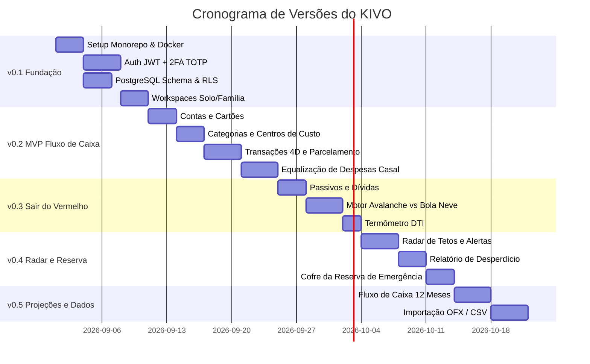

# Roadmap de Desenvolvimento por Versões e Features (MVP) — KIVO

**Status:** Aprovado  
**Metodologia:** Desenvolvimento Iterativo e Incremental por Milestones & GitHub Issues  
**Repositório:** [github.com/anselmo-nonato/kivo](https://github.com/anselmo-nonato/kivo)  

---

## 🎯 Estratégia de Entregas por Versões (Milestones)

---

## 📦 Detalhamento das Etapas e Features (GitHub Issues)

### 🔹 Versão 0.1 — Fundação e Core Multi-Tenant
* **Issue #1:** `[Core] Setup do Monorepo, Docker Compose, FastAPI e Next.js`
  * Estruturação inicial do repositório, containerização com Docker Compose (Postgres 16, Redis 7, Backend FastAPI, Frontend Next.js).
* **Issue #2:** `[Auth] Sistema de Autenticação JWT com 2FA (RFC 6238 TOTP) e Backup Codes`
  * Registro, login em 2 etapas, provisionamento de QR Code para Google Authenticator e 8 códigos de recuperação.
* **Issue #3:** `[Database] Migrações Iniciais PostgreSQL (Esquema Multi-Tenant, RLS e Enums)`
  * Configuração do SQLAlchemy 2.0 Async, Alembic e criação das tabelas fundamentais com isolamento RLS.
* **Issue #4:** `[Workspace] Gestão de Workspaces (Modo Solo e Modo Família) e Convite de Membros`
  * Criação de workspaces, atribuição de papéis (Owner, Member, Viewer) e definição de rendas declaradas.

---

### 🔹 Versão 0.2 — Gestão de Contas e Lançamentos em 4 Dimensões
* **Issue #5:** `[Contas] Cadastro de Contas Bancárias, Carteiras e Cartões de Crédito com Faturas`
  * Gestão de contas correntes, poupanças e cartões com limite, data de fechamento e vencimento.
* **Issue #6:** `[Categorização] Estrutura de Centros de Custo e Árvore de Categorias`
  * Centros de custo (Casa, Família, Casal, Pessoal A/B) e categorias/subcategorias personalizáveis.
* **Issue #7:** `[Transações] CRUD de Lançamentos com Suporte a Parcelamento e Taxonomia 4D`
  * Registro de receitas e despesas com vínculo em 4 dimensões (Dono, Centro de Custo, Essencialidade, Categoria) e geração automática de parcelas futuras.
* **Issue #8:** `[Equalização] Módulo de Rateio Proporcional de Despesas do Casal e Acerto de Contas`
  * Cálculo dinâmico da fatia justa por renda ($R_A / (R_A + R_B)$) e extrato de quem deve quanto para quem.

---

### 🔹 Versão 0.3 — Diagnóstico e Desalavancagem (Sair do Vermelho)
* **Issue #9:** `[Dívidas] Cadastro de Passivos, Taxas de Juros e Amortização Extraordinária`
  * Gestão de empréstimos, financiamentos e cartões rotativos com saldo devedor e taxa de juros mensal.
* **Issue #10:** `[Simulador] Motor de Quitação Inteligente: Método Avalanche vs. Bola de Neve`
  * Algoritmo comparador de quitação acelerada calculando economia de juros e tempo até a liberdade financeira.
* **Issue #11:** `[Diagnóstico] Cálculo Automatizado do DTI (Debt-to-Income) e Termômetro de Endividamento`
  * Classificação de risco de endividamento (Saudável $<30\%$, Alerta $30-50\%$, Crítico $>50\%$).

---

### 🔹 Versão 0.4 — Radar de Gastos e Reserva de Emergência
* **Issue #12:** `[Radar] Parametrização de Tetos Orçamentários e Semáforo de Ritmo de Consumo`
  * Configuração de limites em R$ ou % da receita por categoria e alerta de ritmo de gasto proporcional ao dia do mês.
* **Issue #13:** `[Desperdício] Tag de Classificação de Gastos Desconexos e Relatório de Ralos Financeiros`
  * Marcador de despesas dispensáveis e relatório de impacto no orçamento.
* **Issue #14:** `[Reserva] Cofre da Reserva de Emergência com Meta Dinâmica de Custos Essenciais`
  * Termômetro visual de meta ($6\text{ meses} \times \text{custos essenciais}$) e controle de depósitos/retiradas.

---

### 🔹 Versão 0.5 — Projeções Futuras e Importação de Dados
* **Issue #15:** `[Projeções] Projeção de Fluxo de Caixa para 12 Meses e Simulador de Cenários`
  * Gráfico temporal preditivo de saldo bancário futuro e simulador "Posso Comprar?".
* **Issue #16:** `[Importação] Parser de Faturas e Extratos (OFX e CSV) com Sugestão Automática`
  * Leitor de arquivos bancários OFX/CSV com conciliação automática e categorização assistida.
