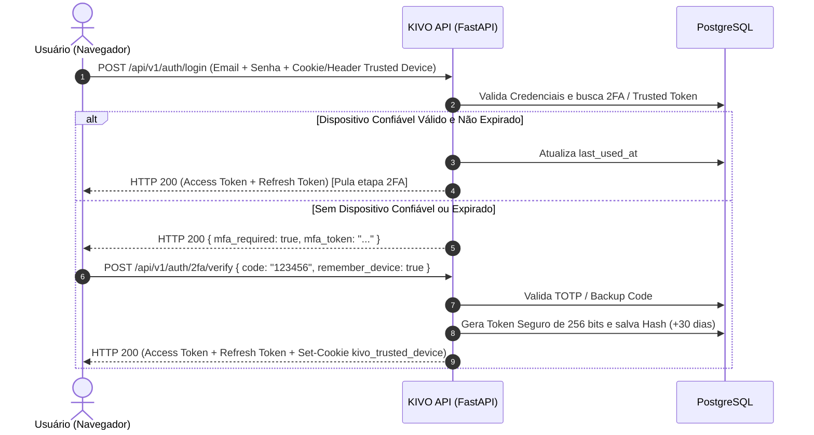

# Arquitetura de Dispositivos Confiáveis (Remember Device 30 Dias) e Sessão Persistente

> **Documento:** `docs/14_trusted_device_2fa_e_persistencia.md`  
> **Status:** Especificado e Aprovado para Implementação  
> **Padrão de Segurança:** OWASP ASVS 4.0 / NIST SP 800-63B / RFC 6749  

---

## 1. Contexto e Motivação
Em sistemas financeiros com autenticação de múltiplos fatores (MFA/2FA), a solicitação obrigatória do código TOTP de 6 dígitos a cada login em dispositivos pessoais e habituais gera atrito de usabilidade (fadiga de 2FA). 

Para proporcionar uma experiência fluida mantendo o mais alto nível de segurança bancária, o KIVO implementa a funcionalidade de **Dispositivo Confiável (*Trusted Device / Remember Device for 30 Days*)**.

---

## 2. Princípios de Segurança (OWASP & NIST Guidelines)

1. **Tokens Criptográficos Fortes:**
   * Nunca utilizar flags booleanas arbitrárias salvas no navegador (`localStorage.isTrusted = true` é estritamente proibido).
   * O dispositivo confiável recebe um token criptograficamente seguro (`secrets.token_urlsafe(32)` com 256 bits de entropia).
   * No banco de dados é salvo exclusivamente o **Hash SHA-256** do token, garantindo que mesmo em caso de dump do banco, nenhum token de dispositivo seja comprometido.

2. **Duração e Renovação:**
   * Validade padrão de **30 dias corridos**.
   * Ao expirar os 30 dias, o sistema exige novamente o código TOTP de 6 dígitos para reautenticar o dispositivo.

3. **Revogação Automática em Eventos Críticos:**
   * **Alteração de Senha:** Todos os dispositivos confiáveis do usuário são invalidados imediatamente.
   * **Desativação ou Reset do 2FA:** Todos os dispositivos confiáveis são revogados.
   * **Painel de Segurança do Usuário:** O usuário pode visualizar a lista de dispositivos ativos e clicar em *"Revogar Dispositivo"* ou *"Desconectar Todos os Dispositivos"*.

4. **Isolamento de Dispositivo (Fingerprinting e Subnet Check):**
   * O token fica vinculado aos metadados do navegador (`User-Agent`, Sistema Operacional e IP de origem).

---

## 3. Modelagem de Dados no PostgreSQL

```sql
CREATE TABLE IF NOT EXISTS trusted_devices (
    id UUID PRIMARY KEY DEFAULT gen_random_uuid(),
    user_id UUID NOT NULL REFERENCES users(id) ON DELETE CASCADE,
    device_token_hash VARCHAR(64) NOT NULL UNIQUE,
    device_name VARCHAR(150) NOT NULL, -- Ex: "Chrome no Windows 11", "Safari no iPhone 15"
    user_agent TEXT NOT NULL,
    ip_address VARCHAR(45) NOT NULL,
    expires_at TIMESTAMP WITH TIME ZONE NOT NULL,
    last_used_at TIMESTAMP WITH TIME ZONE DEFAULT CURRENT_TIMESTAMP,
    created_at TIMESTAMP WITH TIME ZONE DEFAULT CURRENT_TIMESTAMP
);

CREATE INDEX idx_trusted_devices_user ON trusted_devices(user_id);
CREATE INDEX idx_trusted_devices_token ON trusted_devices(device_token_hash);
CREATE INDEX idx_trusted_devices_expires ON trusted_devices(expires_at);
```

---

## 4. Fluxo de Autenticação na API



---

## 5. Endpoints da API

1. **`POST /api/v1/auth/login`**
   * Aceita cabeçalho `X-Trusted-Device-Token` ou cookie `kivo_trusted_device`.
   * Se o hash do token corresponder a um registro ativo e não expirado para aquele `user_id`, emite tokens de sessão sem pedir TOTP.

2. **`POST /api/v1/auth/2fa/verify`**
   * Payload expandido:
     ```json
     {
       "mfa_token": "jwt_challenge_token",
       "code": "123456",
       "remember_device": true,
       "device_name": "Chrome no Windows"
     }
     ```
   * Retorna `trusted_device_token` seguro para ser persistido por 30 dias.

3. **`GET /api/v1/auth/trusted-devices`**
   * Lista dispositivos confiáveis ativos do usuário autenticado.

4. **`DELETE /api/v1/auth/trusted-devices/{device_id}`**
   * Revoga a confiança de um dispositivo específico.

5. **`DELETE /api/v1/auth/trusted-devices`**
   * Revoga todos os dispositivos confiáveis da conta.

---

## 6. Interface do Usuário (Frontend Next.js)

1. **Tela de Verificação do 2FA (`/login`):**
   * Checkbox moderna com texto claro:
     > ☑️ **Lembrar deste dispositivo por 30 dias** *(Não selecione em computadores públicos ou compartilhados)*.
2. **Configurações de Segurança do Perfil (`/settings` ou modal de segurança):**
   * Card com a lista de dispositivos autorizados, data do último acesso e botão *"Desconectar Dispositivo"*.
